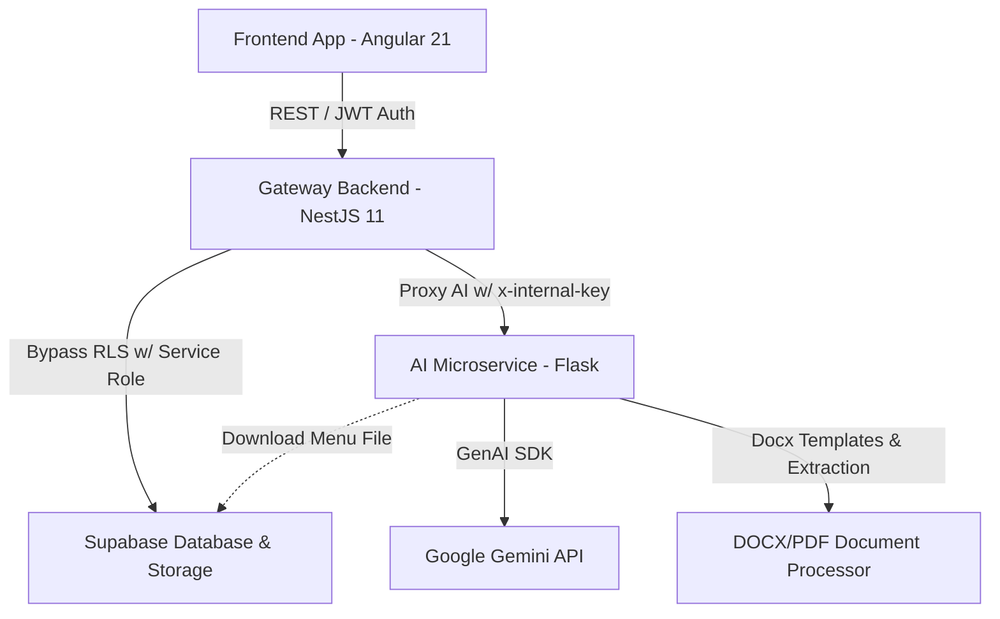

# Nutrilev - Elite Clinical Nutrition Platform 🍏🚀

Nutrilev is a web and clinical platform designed to optimize patient records control, monitor anthropometric progress via analytical charts, and automate personalized nutritional planning using advanced Artificial Intelligence models (Google Gemini).

---

## 🏗️ Project Architecture

The platform is built as a **Monorepo** with a hybrid microservices architecture:



### Core Services
*   **`apps/frontend`**: High-performance web application built with **Angular 21** and **Tailwind CSS**. It features PWA architecture, reactive state management using Angular Signals, responsive layouts, and a dynamic theme engine (Light, Dark, Organic Sage, Lavender Zen).
*   **`apps/api-main`**: Gateway backend built with **NestJS 11**. It manages Supabase authentication, clinical business logic (CRUD for patients, appointments, and progress), and exposes push notifications and transactional email services using **Resend**.
*   **`apps/api-python`**: Microservice built with **Flask** responsible for AI data processing. It uses the Google GenAI SDK (Gemini) to generate and extract diets in `.docx` and `.pdf` formats, as well as automatically parsing shopping lists.
*   **`libs/shared`**: Shared TypeScript library defining unified data interfaces and models to maintain structural integrity across the frontend and NestJS backend.

---

## ✨ Highlighted Features

### 1. Appointment Session Plans ("Paquetes de Citas")
*   Allows the nutritionist to configure session packages (2, 3, or 4 appointments) and log visits associated with progress metrics.
*   The patient portal renders a dynamic circular indicator (glowing progress ring) and a timeline (stepper) detailing the current status of the appointment plan, complete with interactive states and renewal alerts.
*   One-click reset action ("Iniciar Nuevo Plan") to clear and restart the patient's package cycle.

### 2. Clinical AI Menu Generator
*   The AI assistant reads the physical and metabolic context of the patient (usual weight, body fat, muscle mass, pathologies, food allergies, dislikes) and generates a high-precision personalized dietary guide tailored to the target calories.
*   Menus are compiled and downloaded directly into premium Word document (.docx) templates with consistent clinical styling.

### 3. Physical Evolution Tracking & History
*   Allows logging weight, body fat percentage, muscle mass, body circumferences, and specific clinical indicators.
*   Historical logs are displayed in an inline fullscreen history panel with fluid internal navigation, allowing users to compare variations and safely delete old records.

### 4. Smart Shopping List Reader
*   Downloads the active clinical plan in `.docx` or `.pdf` format from Supabase Storage and uses Gemini to structure, categorize, and return a JSON containing a shopping list grouped by supermarket departments (fruits, proteins, dairy, etc.).

### 5. Appointment Confirmation Origin Tracking
*   When a patient confirms an appointment from the patient portal, the note `[Cita confirmada mediante la aplicación Nutrilev]` is automatically appended to the description of the Google Calendar event, distinguishing it from email confirmation links.

---

## ⚡ Architecture & Performance Improvements (Refactoring)

### 1. Asynchronous AI Processing & Non-Blocking Polling
*   **Python AI**: The menu parsing endpoint (`POST /api/parsed-menu`) runs a background execution thread and immediately responds with a `202 Accepted` status and a unique `task_id`, releasing Flask server threads from blocking synchronous network calls.
*   **NestJS Gateway**: NestJS implements a **smart polling** mechanism, querying the task status in Python (`GET /api/tasks/<task_id>`) every 3 seconds, protecting requests from gateway/load-balancer timeouts in production (e.g. Render/Cloudflare).

### 2. Repository Pattern & Decoupling (NestJS)
*   **`PatientRepository`**: Centralizes all database transactions to Supabase, isolating raw PostgreSQL queries from the main business logic services.
*   **`StorageService`**: Decoupled helper handling file uploads, PDF compression, and automated cleanup routines in Cloudflare R2 or Supabase Storage.
*   **`AiGatewayService`**: Independent gateway containing API calls and polling routines bound to the Python AI service.

### 3. PortalStateService & Angular Signals
*   **`PortalStateService`**: Centralizes all data retrieval, offline-first local cache persistence, and reactive signals for the patient portal, reducing the code size of the presentation component (`portal-page.ts`) by over 900 lines of code.
*   **Rate-Limit Resilience (HTTP 429)**: The frontend resilience interceptor automatically catches Gemini API rate limit errors (HTTP 429), alerts the patient with a clean toast notification, and executes automatic exponential backoff retries.

---

## 🛠️ Local Setup & Requirements

### 1. Prerequisites
*   **Node.js**: v18.0.0 or higher.
*   **Python**: v3.9.0 or higher.
*   **Supabase**: Active account and Postgres database configured with `patients` and `patient_progress` tables.

### 2. Environment Variables
Create a `.env` file in the **root** folder of the project with the following variable structure:

| Variable | Description | Used by |
| :--- | :--- | :--- |
| `VITE_SUPABASE_URL` | Supabase API endpoint URL. | Frontend / NestJS |
| `VITE_SUPABASE_ANON_KEY` | Public anonymous key for Supabase. | Frontend |
| `SUPABASE_SERVICE_ROLE_KEY` | Administrative service role key (RLS bypass). | NestJS |
| `SUPABASE_JWT_SECRET` | Secret key for verifying JWT tokens. | NestJS |
| `GEMINI_API_KEY` | API Key to access the Google Gemini model. | Flask |
| `RESEND_API_KEY` | API Key for Resend transactional email deliveries. | NestJS |
| `EMAIL_FROM` | Configured sender email address. | NestJS |
| `FLASK_API_URL` | URL of the local Flask microservice (defaults to `http://localhost:8000`). | NestJS |
| `INTERNAL_API_KEY` | Secret signature for securing interservice authorization. | NestJS / Flask |

---

## 🚀 Installation & Running Locally

### Step 1: Install Node Dependencies
From the root of the project, run:
```bash
npm install
```
*This command initializes the monorepo and links dependencies across the workspaces globally.*

### Step 2: Set Up Virtual Environment and Python Dependencies
Install the required packages for the AI microservice:
```bash
cd apps/api-python
python3 -m venv venv
source venv/bin/activate     # On Windows: venv\Scripts\activate
pip install -r requirements.txt
cd ../..
```

### Step 3: Run the Application

#### Option A: Parallel Execution (Recommended)
To boot all three services in a single terminal stream, run:
```bash
npm start
```
This starts:
*   **Frontend**: `http://localhost:4200`
*   **NestJS Gateway**: `http://localhost:3000`
*   **Python Flask**: `http://localhost:8000`

#### Option B: Individual Service Execution
Open three separate terminals if you need isolated log readouts:
1.  **Frontend (Angular)**:
    ```bash
    npm start --workspace=apps/frontend
    ```
2.  **Gateway (NestJS)**:
    ```bash
    npm run start:dev --workspace=apps/api-main
    ```
3.  **AI Microservice (Python)**:
    ```bash
    cd apps/api-python && source venv/bin/activate && python3 app.py
    ```

---

## 🧪 Testing & Development Bypass

To simplify local development and avoid setting up Google OAuth or production authentication, you can trigger **Developer Mode** using URL query params:

*   **Patient Portal (Bypass)**: Visit [http://localhost:4200/?dev=true&role=patient](http://localhost:4200/?dev=true&role=patient) to log in automatically, simulating a patient's view.
*   **Nutritionist Dashboard (Bypass)**: Visit [http://localhost:4200/?dev=true&role=admin](http://localhost:4200/?dev=true&role=admin) to enter the admin view containing charts and patient indexes.

---

## 📝 Production Notes
*   Make sure to configure a public/private Supabase Storage bucket named `patient_menus` to enable the file uploads of AI-generated `.docx` menus.
*   The frontend communicates exclusively with the NestJS Gateway (Port 3000). NestJS validates and proxies requests to the Python microservice (Port 8000) internally.
