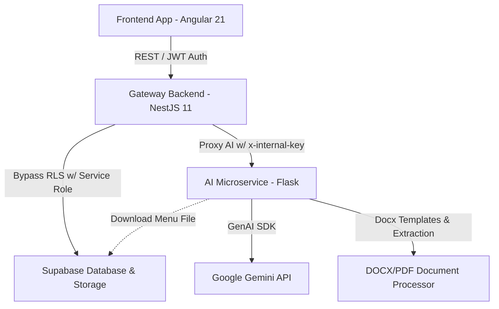

# Nutrilev - Plataforma Clínica de Nutrición de Élite 🍏🚀

Nutrilev es una plataforma web y clínica diseñada para optimizar el control de expedientes de pacientes, monitorear el progreso antropométrico mediante gráficos analíticos y automatizar el diseño de planes nutricionales personalizados empleando modelos avanzados de Inteligencia Artificial (Google Gemini).

---

## 🏗️ Arquitectura del Proyecto

La plataforma está construida como un **Monorepo** con una arquitectura de microservicios híbrida:



### Servicios Principales
*   **`apps/frontend`**: Aplicación web de alto rendimiento desarrollada en **Angular 21** con **Tailwind CSS**. Implementa una arquitectura PWA, manejo de estados reactivos con Signals, layouts responsivos y un gestor dinámico de temas (Light, Dark, Organic Sage, Lavender Zen).
*   **`apps/api-main`**: Gateway del backend desarrollado con **NestJS 11**. Administra la autenticación con Supabase, la lógica de negocio clínica (CRUD de pacientes, citas y progreso), y expone servicios de notificaciones push y envíos transaccionales de correo electrónico mediante **Resend**.
*   **`apps/api-python`**: Microservicio en **Flask** encargado del procesamiento inteligente de datos. Utiliza la librería de Google GenAI SDK (Gemini) para generar y extraer dietas en formato `.docx` y `.pdf`, así como parsear de forma automática listas de súper.
*   **`libs/shared`**: Biblioteca compartida en TypeScript que define interfaces de datos y tipos unificados para mantener la integridad de modelos entre el frontend y el backend de NestJS.

---

## ✨ Funcionalidades Destacadas

### 1. Plan de Pago de Citas ("Paquetes de Citas")
*   Permite a la nutrióloga configurar paquetes de sesiones (2, 3 o 4 consultas) y registrar visitas asociadas a los registros de progreso.
*   En el portal de pacientes, se renderiza un indicador circular dinámico (glowing progress ring) y una línea de tiempo (stepper) que detalla el progreso actual del plan de citas, con estados interactivos y alertas de renovación.
*   Acción de reinicio con un solo clic ("Iniciar Nuevo Plan") para restablecer y reiniciar el ciclo del paquete del paciente.

### 2. Generador Clínico de Menús por IA
*   El asistente de IA lee el contexto metabólico y físico del paciente (peso habitual, grasa, músculo, alergias, padecimientos, gustos) y genera una guía alimentaria personalizada de alta precisión ajustada a las calorías objetivo del paciente.
*   Los menús se compilan y descargan directamente en archivos descargables Word (.docx) premium con estilos consistentes.

### 3. Registro e Historial de Evolución Física
*   Permite registrar peso, porcentaje de grasa, masa muscular, circunferencias e indicadores clínicos específicos.
*   Los registros anteriores e históricos se muestran en un panel inline a pantalla completa con navegación interna fluida y opciones para comparar variaciones y borrar registros anteriores de la base de datos de manera segura.

### 4. Lector Inteligente de Lista de Súper
*   Descarga el plan nutricional activo en formato `.docx` o `.pdf` desde Supabase Storage y utiliza Gemini para estructurar, clasificar y devolver un JSON con la lista de compras del súper ordenada por departamentos (frutas, proteínas, lácteos, etc.).

### 5. Confirmación de Citas con Trazabilidad de Origen
*   Al confirmar citas desde el portal del paciente, se añade automáticamente la nota `[Cita confirmada mediante la aplicación Nutrilev]` en la descripción del evento en Google Calendar, diferenciando este canal de las confirmaciones por correo.

---

## ⚡ Mejoras de Arquitectura y Rendimiento (Refactorización)

### 1. Procesamiento Asíncrono de IA y Polling No Bloqueante
*   **Python AI**: El análisis de menús (`POST /api/parsed-menu`) inicia un hilo en segundo plano y responde de inmediato un `202 Accepted` con un identificador de tarea (`task_id`), liberando al servidor Flask de bloqueos síncronos de red.
*   **NestJS Gateway**: NestJS implementa un mecanismo de **polling inteligente** consultando el estado de la tarea en Python (`GET /api/tasks/<task_id>`) cada 3 segundos, protegiendo las solicitudes contra timeouts de balanceadores de carga en producción (ej. Render/Cloudflare).

### 2. Patrón Repositorio y Desacoplamiento (NestJS)
*   **`PatientRepository`**: Centraliza todas las llamadas a la base de datos Supabase, aislando la lógica de base de datos de los servicios principales de negocio.
*   **`StorageService`**: Mapeador desacoplado para la subida, compresión de PDF y limpieza automática de archivos en Cloudflare R2 o Supabase Storage.
*   **`AiGatewayService`**: Gateway independiente para el despacho de solicitudes y lógica de polling al microservicio de Python.

### 3. PortalStateService y Angular Signals
*   **`PortalStateService`**: Extrae toda la lógica de obtención de datos, persistencia en caché local offline-first y estados reactivos del portal de pacientes, aligerando el controlador `portal-page.ts` en más de 900 líneas de código.
*   **Resiliencia ante Rate-Limits (HTTP 429)**: El interceptor del frontend detecta automáticamente errores de cuotas de Gemini (HTTP 429), notifica visualmente al paciente de forma sutil y realiza reintentos exponenciales automáticos.

---

## 🛠️ Configuración y Requisitos Locales

### 1. Requisitos Previos
*   **Node.js**: v18.0.0 o superior.
*   **Python**: v3.9.0 o superior.
*   **Supabase**: Cuenta activa con base de datos Postgres configurada con las tablas `patients` y `patient_progress`.

### 2. Variables de Entorno
Crea un archivo `.env` en la **raíz** del proyecto con la siguiente estructura de variables:

| Variable | Descripción | Utilizado por |
| :--- | :--- | :--- |
| `VITE_SUPABASE_URL` | Endpoint URL del proyecto de Supabase. | Frontend / NestJS |
| `VITE_SUPABASE_ANON_KEY` | Llave anónima pública de Supabase. | Frontend |
| `SUPABASE_SERVICE_ROLE_KEY` | Llave administrativa de backend para omitir RLS. | NestJS |
| `SUPABASE_JWT_SECRET` | Secreto para verificar la autenticación del usuario. | NestJS |
| `GEMINI_API_KEY` | API Key para acceder al motor de Google Gemini AI. | Flask |
| `RESEND_API_KEY` | API Key de Resend para el envío automatizado de correos. | NestJS |
| `EMAIL_FROM` | Dirección de correo configurada para remitir mensajes. | NestJS |
| `FLASK_API_URL` | Endpoint del microservicio local de Flask (default `http://localhost:8000`). | NestJS |
| `INTERNAL_API_KEY` | Firma secreta interna de autorización interservicios. | NestJS / Flask |

---

## 🚀 Instalación y Despliegue Local

### Paso 1: Instalar dependencias de Node
Desde la raíz del proyecto, ejecuta:
```bash
npm install
```
*Este comando inicializa el monorepo y vincula las dependencias de los workspaces de frontend y api-main de manera global.*

### Paso 2: Configurar entorno virtual y dependencias de Python
Instala las dependencias del microservicio de inteligencia artificial:
```bash
cd apps/api-python
python3 -m venv venv
source venv/bin/activate     # En Windows: venv\Scripts\activate
pip install -r requirements.txt
cd ../..
```

### Paso 3: Arrancar la aplicación

#### Opción A: Ejecución en Paralelo (Recomendado)
Para iniciar los tres servicios en un solo flujo de terminal, ejecuta en la raíz:
```bash
npm start
```
Esto levantará:
*   **Frontend**: `http://localhost:4200`
*   **NestJS Gateway**: `http://localhost:3000`
*   **Python Flask**: `http://localhost:8000`

#### Opción B: Ejecución Individual
Abre tres terminales independientes si necesitas separar la lectura de logs:
1.  **Frontend (Angular)**:
    ```bash
    npm start --workspace=apps/frontend
    ```
2.  **Gateway (NestJS)**:
    ```bash
    npm run start:dev --workspace=apps/api-main
    ```
3.  **IA Microservice (Python)**:
    ```bash
    cd apps/api-python && source venv/bin/activate && python3 app.py
    ```

---

## 🧪 Pruebas y Modo de Desarrollo (Bypass)

Para facilitar el desarrollo y evitar la necesidad de configurar Google OAuth o autenticación de producción localmente, puedes activar el **Modo Desarrollador** a través de parámetros de URL:

*   **Portal de Paciente (Bypass)**: Accede a [http://localhost:4200/?dev=true&role=patient](http://localhost:4200/?dev=true&role=patient) para iniciar sesión automáticamente simulando la vista del dashboard del paciente.
*   **Portal de Nutrióloga (Bypass)**: Accede a [http://localhost:4200/?dev=true&role=admin](http://localhost:4200/?dev=true&role=admin) para entrar directamente a la gestión de expedientes y visualización de tablas.

---

## 📝 Notas de Producción
*   Asegúrate de crear y configurar un bucket de Supabase Storage público/privado llamado `patient_menus` para posibilitar la subida y almacenamiento de los archivos `.docx` generados por el sistema de IA.
*   La comunicación directa del frontend es siempre con NestJS Gateway (Puerto 3000). NestJS canaliza y valida las solicitudes antes de consultar al microservicio de Python (Puerto 8000).
